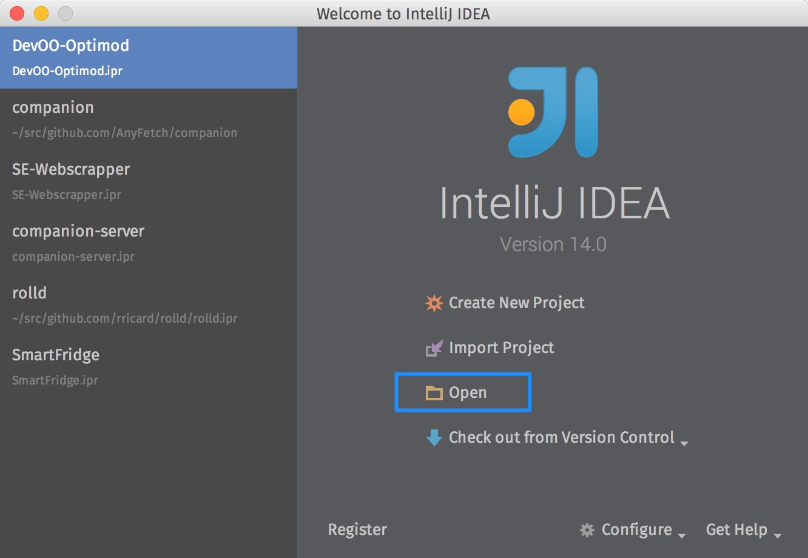
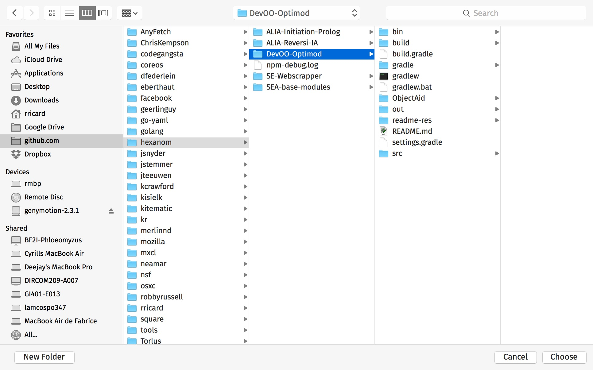
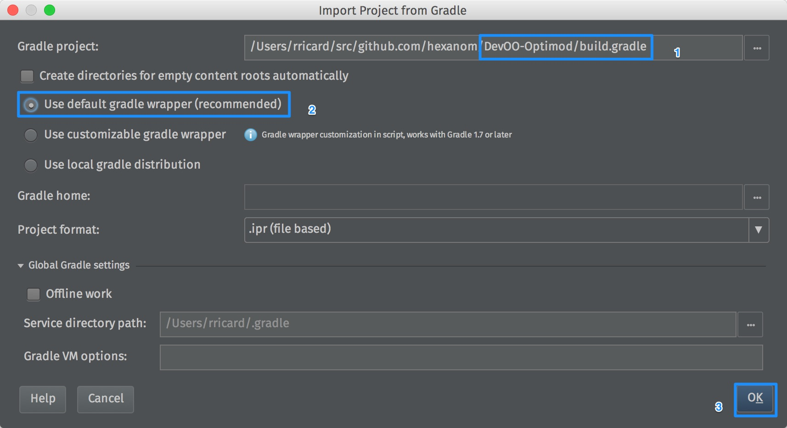
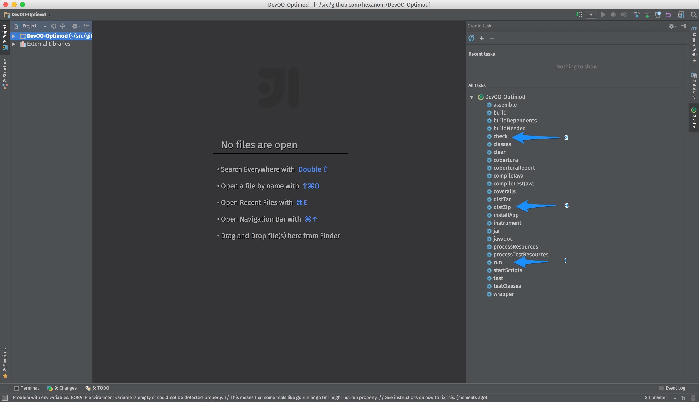
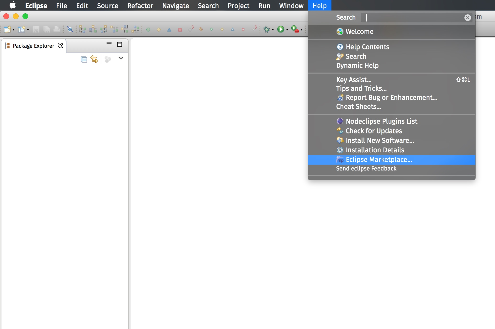

DevOO-Optimod
=============

[](https://travis-ci.org/hexanom/DevOO-Optimod)
[](https://coveralls.io/r/hexanom/DevOO-Optimod)

Usage
-----

### From command-line

#### OSX/Linux

```shell
# start the app
./gradlew run
# run the tests
./gradlew check
# package the app
./gradlew distZip
```

#### Windows

```shell
# start the app
gradlew.bat run
# run the tests
gradlew.bat check
# package the app
gradlew.bat distZip
```

### On IntelliJ IDEA









### On Eclipse Luna



Install all gradle plugins:


And then accept everything and restart the IDE.

Then: File > Import => Gradle Project


License
-------

The MIT License (MIT)

Copyright (c) 2014 Robin Ricard, Edouard Oger, Modou Cisse, Romain Brunat, Bruno Sivanandan, Remi Latapy

Permission is hereby granted, free of charge, to any person obtaining a copy
of this software and associated documentation files (the "Software"), to deal
in the Software without restriction, including without limitation the rights
to use, copy, modify, merge, publish, distribute, sublicense, and/or sell
copies of the Software, and to permit persons to whom the Software is
furnished to do so, subject to the following conditions:

The above copyright notice and this permission notice shall be included in
all copies or substantial portions of the Software.

THE SOFTWARE IS PROVIDED "AS IS", WITHOUT WARRANTY OF ANY KIND, EXPRESS OR
IMPLIED, INCLUDING BUT NOT LIMITED TO THE WARRANTIES OF MERCHANTABILITY,
FITNESS FOR A PARTICULAR PURPOSE AND NONINFRINGEMENT. IN NO EVENT SHALL THE
AUTHORS OR COPYRIGHT HOLDERS BE LIABLE FOR ANY CLAIM, DAMAGES OR OTHER
LIABILITY, WHETHER IN AN ACTION OF CONTRACT, TORT OR OTHERWISE, ARISING FROM,
OUT OF OR IN CONNECTION WITH THE SOFTWARE OR THE USE OR OTHER DEALINGS IN
THE SOFTWARE.


Third-Party Licenses
--------------------

    Creative Commons – Attribution (CC BY 3.0)
    Package designed by Mahmoud Bachir from the Noun Project

    Creative Commons – Attribution (CC BY 3.0)
    Map designed by Simple Icons from the Noun Project

    Creative Commons – Attribution (CC BY 3.0)
    Truck designed by Frédéric Lascours from the Noun Project

    Creative Commons – Attribution (CC BY 3.0)
    Path designed by Gerardo Martín Martínez from the Noun Project

    Creative Commons – Attribution (CC BY 3.0)
    Location designed by Edward Boatman from the Noun Project

    Creative Commons – Attribution (CC BY 3.0)
    Arrow designed by Jamison Wieser from the Noun Project


